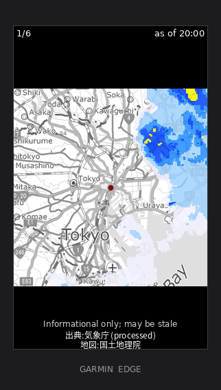

# JMA Rain Radar

Animated, rider-centered rain radar for Garmin Edge devices, using JMA's
high-resolution precipitation nowcast (高解像度降水ナウキャスト). **Japan only.**

<p align="center">
  
</p>

<p align="center">
  <em>Six frames, -15 to +60 minutes, centred on the rider. Rendered from live JMA
  data by <code>proxy/scripts/gen-samples.mjs</code> + <code>gen-device-gif.py</code>.</em>
</p>

The project has three parts:

- **`proxy/`** - a Cloudflare Worker that reads JMA's radar times, fetches and
  composites JMA + GSI tiles into a rider-centered PNG per frame, caches them,
  and serves them to the device.
- **`radar-widget/`** - the Connect IQ widget (Monkey C) that takes a GPS fix, asks the
  proxy for frames, and animates them on screen.
- **`speedtest-widget/`** - a small diagnostic Connect IQ widget that times the
  proxy's `/frames` (`makeWebRequest`) vs its fixed-size `/speedtest` asset
  (`makeImageRequest`) live,
  to compare the Wi-Fi and Bluetooth transport paths (see
  [Connectivity](#connectivity-wi-fi-vs-bluetooth)). Installs alongside the radar.

```
garmin-jma-radar/
├── setup.sh               # one-time toolchain setup (distrobox container + SDK + key)
├── docs/                  # SDK install, troubleshooting, demo media
├── proxy/                 # Cloudflare Worker (Node / wrangler)
│   ├── src/
│   │   ├── index.js       #   routes: /frames (list), /tile (PNG), /speedtest, /health
│   │   ├── jma.js         #   JMA endpoint logic
│   │   ├── tilemath.js    #   lon/lat -> z/x/y + pixel offset
│   │   ├── basemap.js     #   GSI base-map tile URLs
│   │   └── composite.js   #   composite 3x3 neighbourhood -> rider-centered PNG
│   └── wrangler.toml
├── radar-widget/          # Connect IQ widget (Monkey C)
│   ├── manifest.xml       # app id, products, permissions
│   ├── monkey.jungle      # build config
│   ├── build.sh           # build the deployable .iq / .prg
│   ├── run-sim.sh         # build + run in the simulator
│   ├── deploy-device.sh   # dev build with .env baked in + copy to a USB device
│   ├── remove-device.sh   # uninstall the widget from a connected device
│   ├── source/            # RainRadarApp / RadarView / RadarDelegate / Util(+Test)
│   └── resources/         # all app resources
│       ├── shared/        # strings, properties, settings (every device)
│       ├── edge1030plus/  # per-device launcher icon (36x36)
│       └── edge1040/      # per-device launcher icon (40x40)
└── speedtest-widget/      # diagnostic widget (build/run-sim/deploy/remove like the
                           #   radar; reuses radar-widget/.env for the URL + key)
```

## How it works

1. The widget gets a one-shot GPS fix.
2. It calls `GET /frames?lat&lon&z` on the proxy.
3. The proxy reads JMA `targetTimes_N1.json` (observed) and `targetTimes_N2.json`
   (forecast) and returns a **−15…+60 min** window (up to 6 frames, 15-min steps)
   as ordered `/tile?...` URLs, each tagged with its JST valid-time `label` and
   minutes-from-now `offset`. `frameCount` (1–6) is the Wi-Fi maximum; over
   Bluetooth the widget throttles to 3 (see [Connectivity](#connectivity-wi-fi-vs-bluetooth)).
4. The widget requests each tile as a `makeImageRequest`; the proxy composites a
   rider-centered, ≤16-colour (4-bit) PNG (3×3 tile crop on a GSI base map) and
   caches it immutably.
5. The widget animates the frames on a timer, labelling each with its valid time
   (e.g. `21:45 now`, `22:00 +15m`). The on-screen **Wide / Local** buttons switch
   the zoom preset.

Device traffic goes over **Wi-Fi when connected, otherwise the phone over
Bluetooth** - the Edge has no cellular, so a paired phone running Garmin Connect
(or a known Wi-Fi network) with internet is required at run time. The loading
screen shows which path is in use, e.g. `Loading radar (Wi-Fi)…`.

### Connectivity (Wi-Fi vs Bluetooth)

The two paths behave very differently for the image tiles:

- **`/frames`** (JSON, `makeWebRequest`) is fetched directly by the phone and is
  quick on either path.
- **`/tile`** (PNG, `makeImageRequest`) is **not** transferred directly - Garmin
  relays it through its image service. On **Wi-Fi** that's fast (sub-second per
  tile); over **Bluetooth** it's slow and flaky (~20-30 s per tile, the documented
  `BLE_HOST_TIMEOUT` behaviour), so a full set can take minutes.

Because of that, the widget adapts: on Wi-Fi it loads the full `frameCount`; over
Bluetooth it throttles to **3 frames** (`BLE_FRAME_CAP`) so the animation appears
in reasonable time. The **`speedtest-widget/`** app exists to measure this - run
it to watch the two paths' latency live; its image phase pulls the proxy's
`/speedtest` asset, a deterministic PNG shaped like a real frame (~12 KB,
byte-identical on every request), so timings are comparable across runs and
locations. (For loading a full set quickly, prefer Wi-Fi; Bluetooth is best for
a quick "is rain near me" check.)

---

# Setup

Do this once, in order:

1. **[Deploy the proxy](#1-deploy-the-proxy)** to Cloudflare.
2. **[Build & run the widget](#2-build--run-the-widget)** and point it at your
   proxy URL.
3. *(optional)* **[Continuous deployment](#3-continuous-deployment-optional)** for
   the proxy.

## 1. Deploy the proxy

**Prerequisites:** Node 22+ (required by wrangler v4) and a free Cloudflare
account.

```bash
cd proxy
npm install                 # wrangler, upng-js
npm test                    # optional: unit tests (should be all green)
npx wrangler login          # opens a browser to authorise Cloudflare
```

**Set the auth token.** The proxy fails closed - without `PROXY_TOKEN` it returns
`401` for every request. Generate a random token and store it as a Worker secret
(never commit it):

```bash
openssl rand -hex 16                 # generate a token; copy it
npx wrangler secret put PROXY_TOKEN  # paste it when prompted
```

**Deploy.**

```bash
npx wrangler deploy
# prints your public URL, e.g.
# https://jma-rain-radar-proxy.<subdomain>.workers.dev
```

Note that URL - you'll paste it into the widget settings later.

<details>
<summary><strong>Run the proxy locally (optional)</strong></summary>

Worker secrets aren't available to `wrangler dev`, so put the same token in
`proxy/.dev.vars` (git-ignored):

```bash
echo "PROXY_TOKEN=<your-token>" > .dev.vars
npx wrangler dev                     # http://localhost:8787
curl "http://localhost:8787/frames?lat=35.68&lon=139.76&z=10&n=6&key=<your-token>"
curl "http://localhost:8787/health"  # -> {"ok":true,"rateLimiter":false} (no token needed)
```
</details>

<details>
<summary><strong>Rate limiting (recommended)</strong></summary>

`/tile` is cheap to call but expensive to serve, so cap the request rate.

**This repo already ships per-IP rate limiting** (60 requests / 60s) via the
`RATE_LIMITER` binding in `wrangler.toml`, enforced in `src/index.js`. It
activates on `npx wrangler deploy`; tune `limit`/`period` to taste. It no-ops
when the binding is absent, so `wrangler dev` works without it.

```toml
# wrangler.toml
[[ratelimits]]
name = "RATE_LIMITER"
namespace_id = "1002"                 # a fresh id (see gotcha below)
simple = { limit = 60, period = 60 } # period must be 10 or 60
```

Two gotchas:
- **Use a fresh `namespace_id`.** One first registered under the older
  `[[unsafe.bindings]]` form deploys as a *no-op* limiter that never enforces.
- **Enforcement is eventually-consistent.** Verify with *sequential* requests
  (`curl '…&cb=[1-120]'` → ~60×`200` then `429`). A concurrent burst races the
  counter and mostly slips through - that's expected.

Alternatively, if the Worker runs on a custom domain, use a Cloudflare dashboard
**WAF → Rate limiting** rule on `URI Path contains /tile` (no code change).
</details>

## 2. Build & run the widget

### Install the Connect IQ SDK

On Ubuntu 24.10 or newer, from the repo root:

```bash
./setup.sh      # idempotent: container + SDK + simulator libs + signing key
```

VS Code and plain-Ubuntu installs, plus how to create the developer signing key
by hand, are in **[docs/connect-iq-sdk.md](docs/connect-iq-sdk.md)**.

### Run in the simulator

```bash
cd radar-widget
./run-sim.sh                 # -d <device>, --lat/--lon to override
```

`run-sim.sh` **brings the simulator up** with the app loaded: it starts the
simulator if it isn't already running (injecting a GPS fix - defaults to Tokyo,
override with `--lat`/`--lon`), side-loads the `.prg`, and streams the device
console. The default device is `edge1030plus` (`-d <device>` to change it). If a
simulator is already open it's reused (close it from its own window first if you
want a fresh one - a forced restart wedges the SDK's debug port). Then, in the
simulator:

1. **Settings → App Settings** → set **Proxy URL** (your `…workers.dev` URL) and
   **Proxy key** (your `PROXY_TOKEN`). *(Or bake them in via `radar-widget/.env`; see
   [Settings](#settings).)*

The widget acquires the fix, fetches frames, and animates. (To move the position
after launch, use **Simulation → GPS/Position** in the sim UI.)

**Fast inner loop - reload into the open sim.** Once a simulator is running, a
plain `build.sh` loads the new build straight into it (no restart), so the usual
edit/run cycle is `run-sim.sh` once, then `build.sh` after each change:

```bash
./build.sh -d edge1030plus   # builds, then loads into the running simulator
```

If no simulator is open, `build.sh` just builds. Suppress the auto-load with
`CIQ_NO_SIM_UPDATE=1`.

> VS Code users can instead just press **F5** and pick a device.

### Build a deployable package

```bash
cd radar-widget
./build.sh                   # -> bin/RainRadar.iq   (Connect IQ Store package)
./build.sh -d edge1030plus   # -> bin/RainRadar-edge1030plus.prg  (single device)
./build.sh --help            # all options
```

`RainRadar.iq` contains release builds for every product in `manifest.xml` and is
what you upload to the Connect IQ Store (the CLI equivalent of *Monkey C: Export
Project*).

If a simulator is open when you build, `build.sh` also loads the result into it
(see [Run in the simulator](#run-in-the-simulator)); for a store `.iq` it
compiles a single-device `.prg` for the simulator's current device to load.
Set `CIQ_NO_SIM_UPDATE=1` to skip this.

### Run on a real device

Put a dev build on your own Edge with **`deploy-device.sh`**, which bakes your
`radar-widget/.env` secrets into the build and copies it over USB:

```bash
cd radar-widget                    # fill in radar-widget/.env first (PROXY_BASE, PROXY_KEY)
./deploy-device.sh           # build edge1030plus, copy to the mounted Edge, eject
```

It locates the USB-mounted Edge, builds with `.env` baked in, copies the `.prg`
into `Garmin/Apps/`, clears any stale on-device settings so the baked values win,
and ejects. (`-d <device>` for another Edge, `--dest <dir>` to point at the Apps
folder, `--no-eject` to leave it mounted; Linux-only - it uses `udisksctl`.) On
other platforms, build a `.prg` with `./build.sh -d <device>` (with `radar-widget/.env`
filled in, so the config is baked in) and copy it into `Garmin/Apps/` yourself.

Then unplug and open **Rain Radar JP** from the **widget loop** - swipe down from
the home screen, then left/right. It's a *widget*, so it won't be in the device's
Connect IQ Apps menu. It acquires a GPS fix, fetches frames, and animates.

**On-device controls:** the on-screen **Wide** (~140 km) / **Local** (~36 km)
buttons switch the zoom preset; a tap elsewhere does nothing (so a stray touch
can't flip the zoom). After a failure a tap acts as **Retry**; **Back** exits.

### Settings

The widget reads these app settings at runtime - set them in the simulator's App
Settings, via Garmin Connect (Connect IQ **Store** installs only; see below), or
bake them into a build through `radar-widget/.env`:

| Setting | Required | Notes |
| --- | --- | --- |
| **Proxy URL** (`proxyBase`) | yes | your `…workers.dev` URL, no trailing slash |
| **Proxy key** (`proxyKey`) | yes | the Worker's `PROXY_TOKEN` - an `openssl rand -hex 16` value, **not** a Cloudflare API token |
| **Zoom** (`zoom`) | no | 8 (regional) – 11 (street); default 8 (Wide) |
| **Frame count** (`frameCount`) | no | 1–6; the **Wi-Fi maximum** (over Bluetooth the widget throttles to 3) |

`radar-widget/.env` (git-ignored) holds `PROXY_BASE` / `PROXY_KEY`; `build.sh`,
`run-sim.sh`, and `deploy-device.sh` bake them into that build only and restore
the committed defaults afterward, so secrets never land in git.

**Sideloaded vs. Store.** A `.prg` you copy on manually (sideload) isn't tied to
your Garmin account, so it **never gets a Settings screen in Garmin Connect** (a
Connect IQ limitation) - bake the config in, which is what `deploy-device.sh`
does. Only apps installed from the Connect IQ **Store** show editable settings in
**Garmin Connect → Devices → your Edge → Connect IQ Apps → Rain Radar JP →
Settings**. Either way a phone running Garmin Connect (with internet) must be
paired at run time, since the Edge has no cellular.

### Run the unit tests

The pure helpers in `source/Util.mc`, plus `FrameCache` and `FramePipeline`, are
covered by `(:test)` functions that compile only into a `--unit-test` build:

```bash
cd radar-widget
monkeyc -d edge1040 -f monkey.jungle -o bin/test.prg -y ../developer_key.der --unit-test
monkeydo bin/test.prg edge1040 -t    # prints PASS/FAIL per test
```

CI runs these on every PR (`.github/workflows/widgets.yml`), headless under Xvfb:
53 tests across the two widgets. Note that `monkeydo` exits non-zero even when
every test passes, so the `PASSED`/`FAILED` summary line is the only reliable
signal -- see `.github/scripts/run-ciq-tests.sh`.

### Secret scanning

[gitleaks](https://github.com/gitleaks/gitleaks) guards the proxy token and
Cloudflare credentials (config in `.gitleaks.toml`). CI runs it on every push/PR
(`.github/workflows/secret-scan.yml`); install the local pre-commit hook so a
secret is caught *before* it's committed - the main risk is `build.sh` baking the
proxy token into `resources/shared/properties.xml` during a build:

```bash
pipx install pre-commit   # or: brew install pre-commit / pip install pre-commit
pre-commit install        # one-time, per clone
pre-commit run --all-files   # optional: scan the whole repo now
```

### Troubleshooting

Device, simulator, proxy and CI symptoms are collected in
**[docs/troubleshooting.md](docs/troubleshooting.md)**.

## 3. Continuous integration & deployment

| Workflow | Runs on | What it does |
| --- | --- | --- |
| `proxy.yml` | every PR; `proxy/**` pushes to `main` | typecheck, tests with coverage thresholds, `npm audit` (prod deps), bundle dry-run. On `main`, deploys to Cloudflare and then smoke-tests `/health` -- asserting both that the Worker routes and that the `RATE_LIMITER` binding is actually live. |
| `widgets.yml` | every PR and push | Installs the Connect IQ SDK headlessly, compiles both widgets for every product in their manifests with warnings treated as errors, and runs the 53 Monkey C unit tests in the simulator under Xvfb. |
| `lint.yml` | every PR and push | shellcheck over every `*.sh`, actionlint over the workflows, ESLint over the proxy. |
| `secret-scan.yml` | every PR and push | gitleaks across the full commit history. |
| CodeQL | push + weekly | GitHub default setup. |

Deploys are gated behind the `production` environment, whose branch policy only
permits `main`. See [CONTRIBUTING.md](CONTRIBUTING.md) for how to run each of
these locally before pushing.

**Required GitHub repo secrets** (Settings → Secrets and variables → Actions):

| Secret | What it is | Where to get it |
| --- | --- | --- |
| `CLOUDFLARE_API_TOKEN` | Token CI uses to publish the Worker | see below |
| `CLOUDFLARE_ACCOUNT_ID` | Your 32-char hex account id | `npx wrangler whoami` |

**Create the API token:** [dash.cloudflare.com/profile/api-tokens](https://dash.cloudflare.com/profile/api-tokens)
→ **Create Token → Create Custom Token**. Give it **Account · Workers Scripts ·
Edit** (optionally also **Account · Account Settings · Read**), scope it to your
account, and create it (shown once).

**Store the secrets:**

```bash
CLOUDFLARE_API_TOKEN=<paste> npx wrangler whoami   # verify token + print Account ID
gh secret set CLOUDFLARE_API_TOKEN                  # paste the token
gh secret set CLOUDFLARE_ACCOUNT_ID                 # paste the Account ID
```

`PROXY_TOKEN` is **not** a CI secret - it's a Worker secret set once with
`wrangler secret put PROXY_TOKEN` and persists across deploys.

---

## Attribution & compliance

- **JMA data** is under the **Public Data License v1.0**: commercial use is OK,
  but attribution is required and processed output must say so. The widget shows
  a combined credit line `JMA Weather (processed) · GSI Map` (romanized - device
  fonts lack CJK glyphs unless the device language is Japanese); keep it visible.
  Carry the full form in the store listing:
  *Source: Japan Meteorological Agency website - https://www.jma.go.jp/*
- **GSI base map** (国土地理院コンテンツ利用規約, under Public Data License v1.0)
  requires a source credit - and a link to the tile-list page - but no prior
  approval for real-time web/app display. Shown on-device as `GSI Map`;
  store-listing form (carries the required link):
  *Map: Geospatial Information Authority of Japan (地理院タイル) -
  https://maps.gsi.go.jp/development/ichiran.html*
- The app **redisplays JMA's own nowcast** (observed N1 + JMA's published forecast
  N2, to +60 min) - it does **not** synthesize forecasts or issue warnings
  (Weather Service Act Art.17 / Art.23).

---

## License

The code in this repository is licensed under the [MIT License](LICENSE).

This covers the code only. The JMA precipitation data and GSI base map served
through the app carry their own terms - see **Attribution & compliance** above
and keep the required credits intact.
